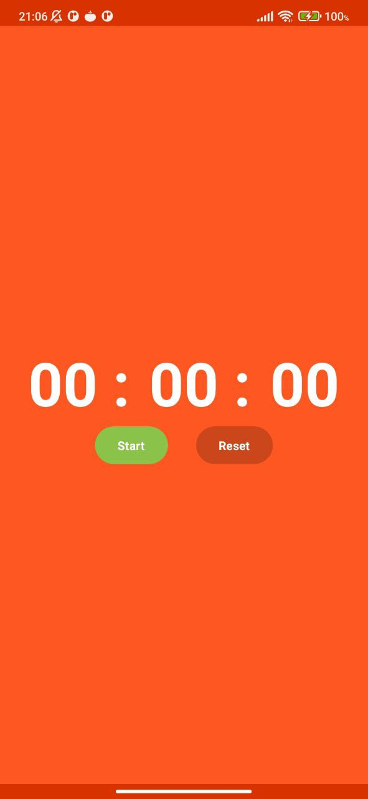
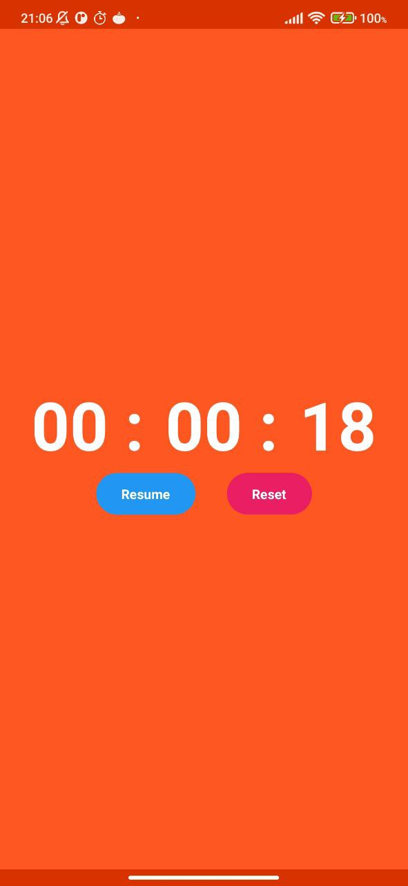
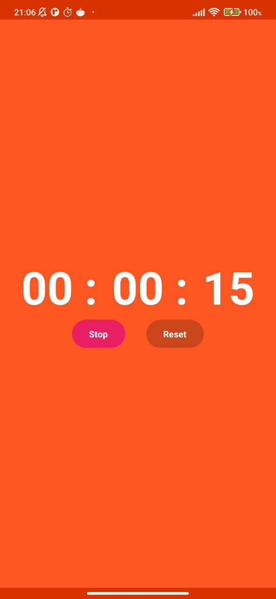
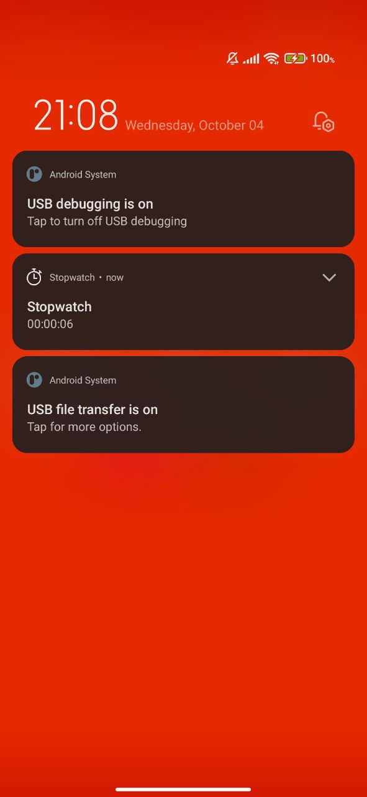

# About
Simple and minimalist stopwatch app for Android developed using Kotlin based on Jetpack Compose. It offers various features and utilizes modern Android development practices.

# Features
* Start: Start the stopwatch timer.
* Stop: Pause the stopwatch timer.
* Resume: Continue the stopwatch timer from where it was paused.
* Reset: Reset the stopwatch timer to zero.
* Foreground Service: The stopwatch runs as a foreground service to ensure it's always visible to the user.
* Post Notification: The app requests notification permission to display a persistent notification while the stopwatch is running.
* Light and Dark Mode Support: The app supports both light and dark themes to provide a personalized experience.
* Bound Services: Bound services are used for managing the stopwatch functionality.

# Libraries
* Dagger Hilt
* Jetpack Compose

# Screenshots

